My friend Mike Garcia (of L.V.Berkner High School/Texas Christian University/Phantom Regiment fame) recently shared his reflections on the previous decade. Anyone alive in early 2020 is seeing these type of posts from friends. The difference about Mr. Garcia's post – he adds what he _learned_ from each year. His positive take on the process of reflecting on the previous ten years made an impact on me.

The 2010s for me personally started off with a steady pace in my music education career. The decade's end found me staring into a computer screen slinging code around every day. Our tremendous family was constant through it all. The last ten years were quite an adventure!

# 2010

### Positive Experience

Melissa and I celebrate our 10-year wedding anniversary! We started dating back in 1995 in high school at Lakeview Centennial in Garland ISD. We went to college together. We got married on 12/15/2000 while still in college, at the tail end of a BUSY music semester for me. Ten years! Woot!

Our family also got a little puppy that we named Chewbacca and call "Chewie". I was pretty ambivalent towards him, but Chewie eventually won me over. He is hyper-intelligent, well-behaved, and a faithful companion to all in our family.

### Learning Experience

My long-standing sore knee got a lot worse in 2010. I had bursitis way back in 1996 when I performed with the Troopers quad line. I think that minor injury only got worse in my knee over time. After Troopers I still had five years of college marching band and another summer of drum corps coming up. Looking at my knee, one could easily see a  golf ball-sized cyst. Also, the cartilage in the right knee was torn and needed repair. The surgery was technically called "derangement of the right lateral meniscus" – my right knee was deranged! I had been doing P90X workouts with the NM band on the blacktop parking lot and at home some. Lots of high impact workouts. I am not good at "giving in", always pushing through hard times. But on this occasion, I should have listened to my body and gone to the doctor much earlier than I did. I ended up missing school for a week and had to be on crutches for a while during recovery. Physical therapy was incredibly painful, too.

I also had the flu over Christmas in 2010. With Melissa and I both being teachers, and Isaac, Alexis, and Stephen all in school, it could have come from anywhere. Now, I always get a flu shot! I was also getting fairly overweight during this year. Weight fluctuates for me a bit, but I was noticeably sluggish and not feeling great. The knee surgery also led to more inactivity than I prefer.

# 2011

### Positive Experience

Early in the year Andy Eldridge asked me to be the best man in his wedding to Jennifer. I looked in the mirror, and I felt and looked unhealthy. I started making some changes with regards to eating less sugar and bread and being more active. I ended up getting fairly healthy by the time of the ceremony. Isaac and Alexis got to be in the wedding, too. And the Dallas Mavericks won the NBA Championship during their wedding reception. It was a GREAT DAY!

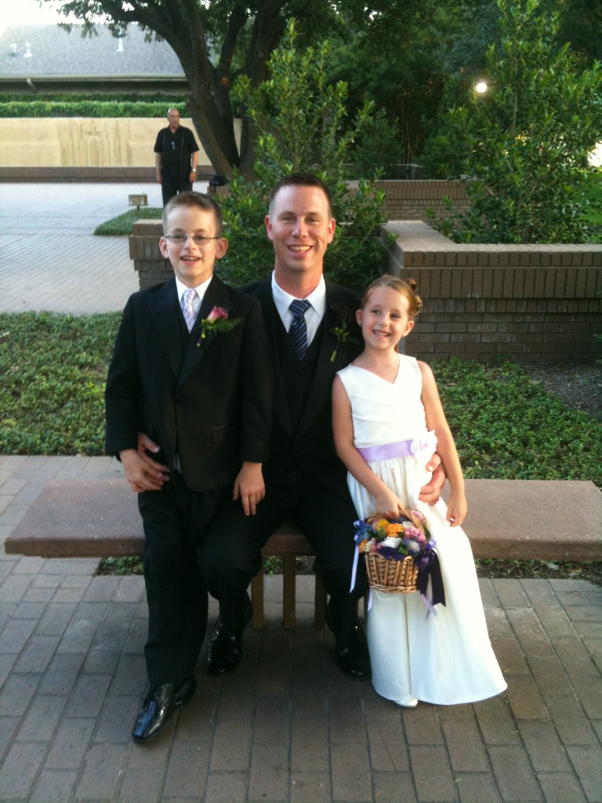

Also of note:
- Both Isaac and Alexis had their tonsils and adenoids removed on St. Patrick's Day. Lots of ice cream and much less strep in our house!
- Family vacation (plus Melissa's parents) to San Antonio to Sea World.
- My little brother Stephen turned 13 and our mom came over for a rare visit, one of our last times to visit with her.
- Stephen started band playing percussion. Since we were cash-strapped, we stopped paying for cable TV to afford percussion lessons for Stephen. This began the long mental thaw from watching so much one-sided cable TV news for me. Shout out to his teacher [Patricia Islas](https://www.teamislas.com/) for the lessons and inadvertently making our family more open-minded!

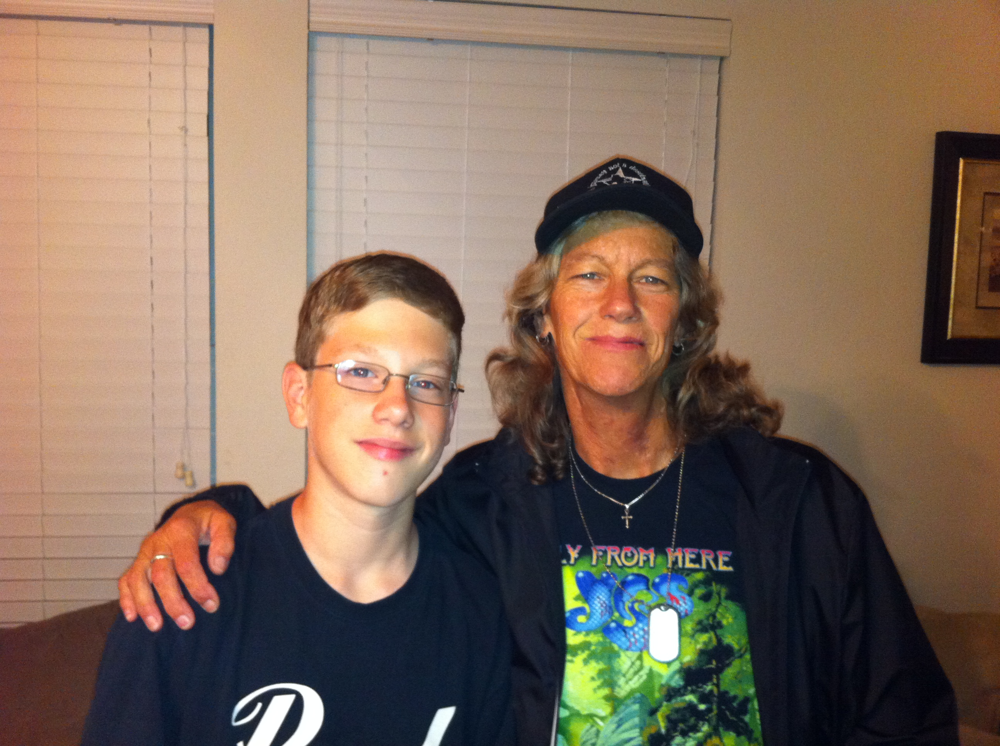

### Learning Experience

Later in the year, Melissa was having a lot of pain and was rushed to Baylor Hospital in Dallas. I left school to be with her. The doctor came in to tell us that Melissa _seemed_ to have appendicitis. She made sure we were seated, and then she told us, "We cannot do an MRI because you are pregnant." Wow, what unexpected but great news! We were adding a third child of our own to the family. So when Olivia would come, Isaac and Alexis would be 9 and 7 years old, respectively. That large gap meant that we had to prepare all the "having kids" stuff that we thought was behind us! Melissa had an appendectomy the next day just to be sure. Her appendix turned out to be inflamed, so we were all glad they removed it before her pregnancy progressed too far.

# 2012

### Positive Experience

In June I was in the middle of teaching the drum line camp at North Mesquite High School. Melissa called and said, "We are going to the hospital!" I left my students in the capable hands of our million-dollar percussion staff, and went to be with my lady. The next day on Thursday morning about 6:30am Olivia Rose was born. Our family was complete!

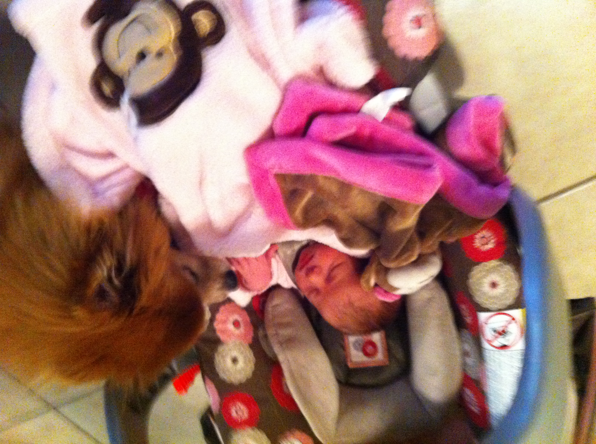

My uncle Ricky got married at the young age of 57 to a wonderful woman named Teri. They went to high school together in the first graduating class of Berkner High School in Richardson, TX. They knew each other way back when, and Ricky always liked Teri, but he never asked her out because she had a boyfriend. No matter, they found each other later in life and are a very happy couple. Again, this was one of the rare chances to see my mom Denise and give her a big hug.

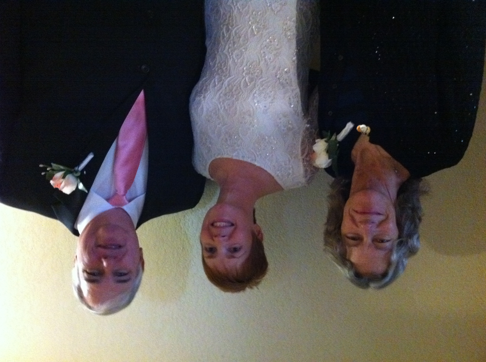

I also had a great time hanging out with some of my best friends from high school. One Christopher Vigneron was finally visiting in the US again from his new home in the Czech Republic, so we convened our small group of friends for a meal and some drinks. Good times were had by all.

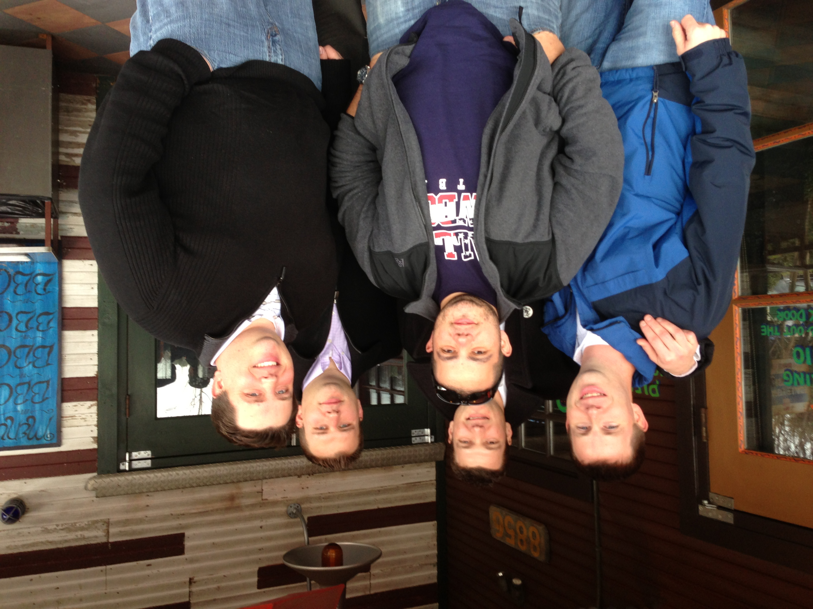

### Learning Experience

My mom Elizabeth Denise Mathew got very sick, went on life support, and we had to make the decision to remove her from life support on Christmas Eve. I loved my mom, but I disliked many of her decisions. She struggled with personal demons that seemed impossible to shake. She was a heavy drug user for most of her life starting when she was in middle school. I grew up around the drug scene until she had me go live with her parents when I was ten years old. Over the years my mom was staying with friends or out on the street. It was difficult to know how to get in touch most of the time. In retrospect I wish I had worked harder to give her aid for her afflictions or at least tried to find her to show her comfort in some way.

# 2013

### Positive Experience

I finished my fifth year at North Mesquite. Excellent culture. Solid staff. Students improving and a good structure for the program. In the early summer I received a call that the Berkner High School percussion job was opening. I applied for Berkner, and I got the job. The North Mesquite program was in a good place to hand over to my successor Steven Washington. Working at Berkner meant a lot to me because my mom and her brothers went to Berkner. I also went to a feeder elementary school and junior high school for Berkner before my family moved to the nearby suburb of Rowlett way back in 1991. In 2002 I completed my student teaching at Berkner and Apollo Junior High in the middle of my teaching the drum line and percussion lessons for two years at Berkner. The Berkner program has always meant a lot to me, and it still does!

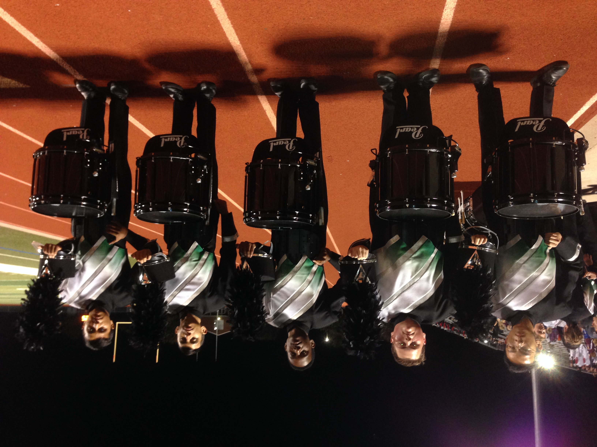

During this year our family was also experiencing the fun times of having a little baby to care for. Our older children Isaac and Alexis were huge help to us!

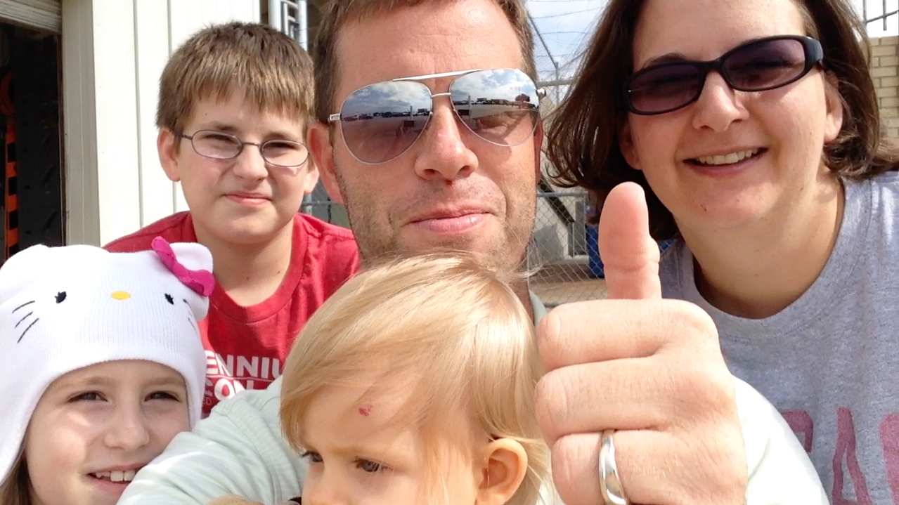

### Learning Experience

Thinking back and looking at social media posts, it's clear that I was working way too much at my band jobs. I was also taking graduate school classes for my Master in Music Education degree, so that meant weekly driving to Commerce. I needed to work a bit less during this crucial time when my kids needed daddy to be home more.

# 2014

### Positive Experience

I loved working at Berkner. The staff was phenomenal with a tremendous focus on results and student-centered learning. My percussion partner was [Scott Ward](http://themusicward.com/home). We had gone to college together at [Texas A&M University-Commerce](http://www.tamuc.edu/academics/colleges/humanitiesSocialSciencesArts/departments/music/studios/percussion/default.aspx), and our shared experiences over the years meant that we were nearly always on the same page. Real life legends on staff meant allowed me to soak in music education wisdom every single day in every rehearsal.

The percussion-centric event at Berkner is the "Night of Drumming". This huge spectacle includes about 100 percussion students from all Berkner campuses in grades 6-12. The 2014 edition sold about 800 tickets. It was a blast to put together, though we were glad for it to finish. Lots of work goes into a huge event like that! After the 2014 "Night of Drumming", the entire band staff went out for dinner together. Although Scott and I didn't know it, a famous Texas college band director had "stopped by" our concert that evening. He told us that he enjoyed the concert and that it was one of the most _musical_ concerts he had gone to. Wow, what a compliment since that was always our aim!

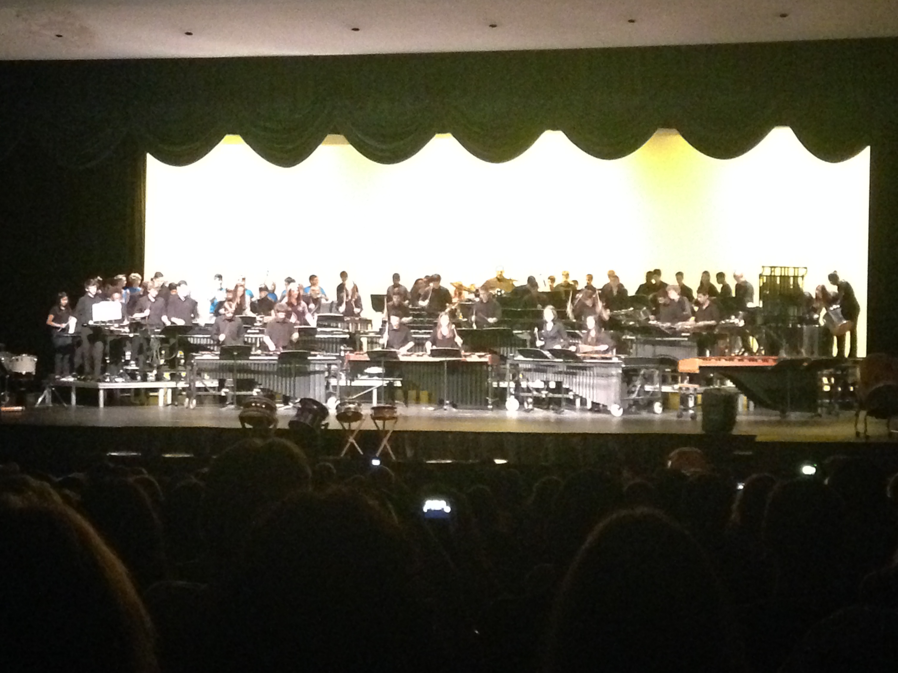

The flurry of events throughout the spring semester meant that I barely saw my own children at the end of the year, though. I left Berkner High School in the summer for a job at Forney High School. On paper this was a huge win. Our family lived in the neighborhood directly between the one high school and the one middle school on our side of Forney. I ate lunch at home every day and rode my bike to teach at the middle school if the weather was nice. This position paid more than my Berkner position, always helpful with three kids and my brother living at home with us still. I calculated that I would be saving about $100/mo in gas, too.

The main decision to pursue this was made so I could be home more. I expected there to be less time at the schools since there is only one middle school (I usually worked in bigger schools with 2-3 feeder middle schools). It worked! I saw my family more for that entire school year. This was also the first place in my career where the football stadium was on the same campus at the high school. That's a huge timesaver when you consider how much stuff has to move for any rehearsal or performance.

Also of note:
- Melissa began graduate school studying for work as a school librarian
- Isaac started band playing French horn.

### Learning Experience

The cavaet was that I was miserable at Forney High School. The previous school year at Berkner I was surrounded by a like-minded team, all rowing our boat in the same direction, positive experiences for students, accountability to a high standard while being respectful. Forney was as opposite as one could be. For many reasons, I decided early in the year that I was in the wrong place. I prayed that God would bring me through the school year and into some other path for the following year and to show me how to navigate the current situation to find out how I could use my influence for the greatest good.

I hold fast to the idea that chasing trophies and focusing on "winning" is a completely flawed philosophy. Unfortunately, the "we must win" approach was prevalent at Forney High School during that time. I have always focused on being the best "me" today. Show up prepared, have a great attitude, and work hard. This has served me well in life time and again. I hope that some of my Forney High School students got a glimmer of that from me. And, as should always be expected, every school year is different with different students and staff, so that band program is likely much _much_ different now.

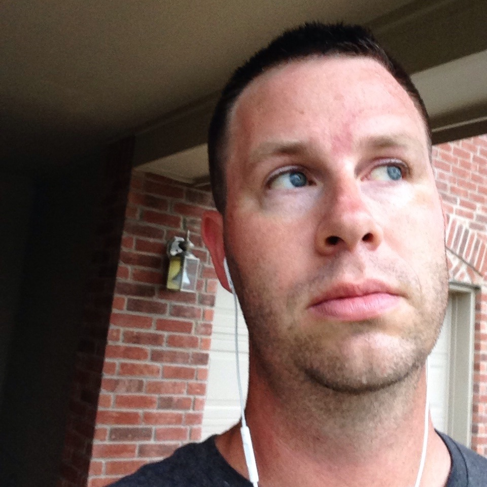

# 2015

### Positive Experience

As covered in the previous year, I had determined to get through the year but by the Grace of God. I only knew of two openings in schools that were a reasonable driving distance from my home. I applied to both of them. One of them would have been a perfect fit for me – I had worked in the district before, I knew almost all the former percussion directors dating back decades, I really respected and liked the head director. But neither position worked out. A friend of mine, Kyle, let's call him, mentioned to me that I had been into coding and making websites before. He told me a tale about a friend named Daniel D. and how Daniel went to a coding bootcamp to jump start a new career. I was intrigued and immediately started researching coding schools.

Looking back, I started programming when I was 9 or 10 years old. I took two years of Computer Science (CS) class in high school in the 1990s. My plan at that point was to go to college to study CS and get a job as a computer programmer (as we called it then). I ultimately decided on music education as a career, a path I do not regret. But that CS background served me well during this period.

I called up Daniel D., and we had a nice, long chat about coding school including what he learned, the job market, what he would have done differently, and more. His generosity and experience helped me make a decision to attend the coding bootcamp called The Iron Yard in Austin, the same organization that Daniel had attended. I applied to The Iron Yard in June 2015, had an interview with the front end instructor [Aaron Larner](https://twitter.com/alarner), and I was accepted to the program!

But I still had not resigned from my job at Forney High School. I went to the HS to start gathering my things, and I wrote a resignation letter to give to the principal. The head director came into our big percussion room to talk to me. This was fortuitous as I needed to tell him in person about this. He approached me and said, "I hear you have been interviewing at other places, Mike." _Awkward_. I said, "Well, yes, I am unhappy here." I then proceeded to tell him my plan about switching careers to go into coding full time. His response is etched in my mind as how he thought of the staff members, "Well, it will be easy to find another percussion guy." This is in contrast to my former boss's response when I told him that I would be leaving Berkner, a very positive plea to get me to stay.

Since I had no high school marching band duties, I was able to help out my good friend [Andrew Eldridge](https://andreweldridge.com/) as a teacher for the drum line at the University of Texas at Arlington. This is the first time I was able to teach college since way back in 2001 and 2002 when I helped Brian West as a quad tech at Texas Christian University. (Fun fact: when I was helping teach TCU in 2001, I was still an undergraduate student at Texas A&M-Commerce.)

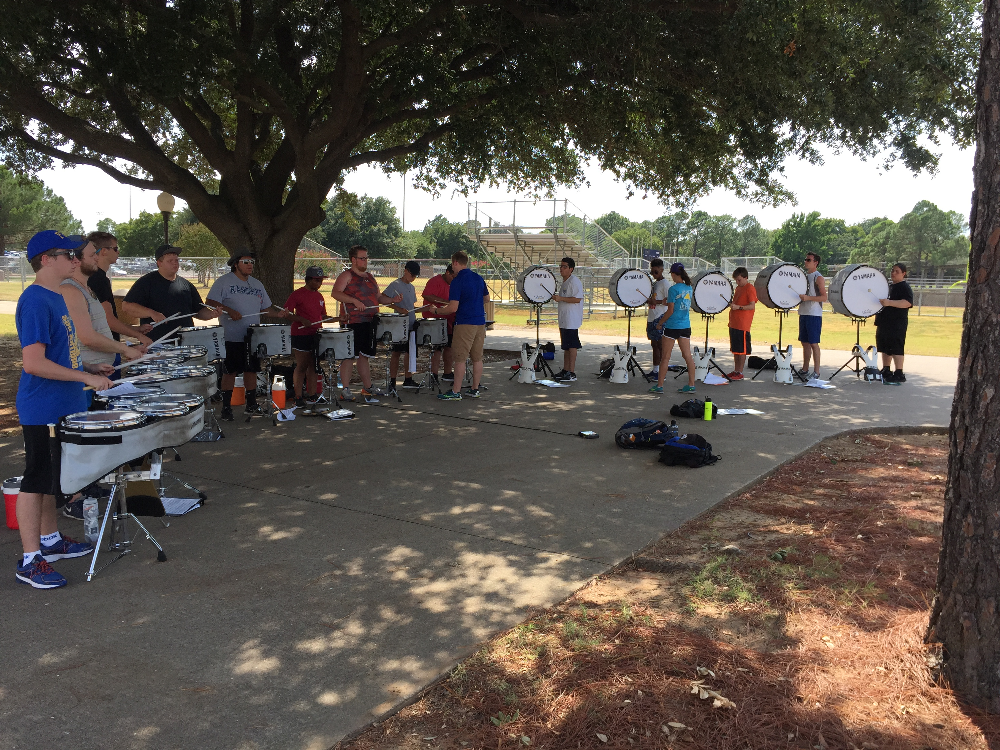

My first day of coding school in Austin coincided with the first day of school for our kids and Melissa. The Sunday immediately before this fateful date, Alexis was baptized at Lake Pointe Church-Forney. Our family and friends attended the baptism, and we all went out for TexMex for lunch. I needed to leave from that lunch to head to Austin for The Iron Yard code school. Melissa walked me out, we exchanged hugs and kisses and tears, and I got on the road to Austin. I stayed in Austin (technically in Plfugerville) with my old friend Dave Reyes. His kindness and generosity cannot be overstated during my three months of code school.

For The Iron Yard, the classes were fun and challenging, and the assignments were sometimes easy, sometimes extremely challenging. It felt as if I were drinking from a fire hose. Thankfully I had done a good deal of study in the basics of JavaScript for months ahead of time, so that solid foundation helped me. I went home to Forney every weekend to hang with the family. It was a very tough 12-13 weeks for all us, but the isolated time away helped me stay focused and working hard. This was also the first time since the fall of 1992 where I had not been attending weekly high school football games (excepting a bit of college where I was not teaching high school yet). I felt _free_!

When I got out The Iron Yard, my "job" was to find a job as soon as I could. For five weeks I searched for a gig where I knew I would thrive, a small team with a good culture who knew a lot about themselves. My days were spent between learning more about coding and searching all over for gigs. I would alternate between the Mesquite public library and Starbucks for my "work" place. After about three weeks of searching, I came across a job posting for a position at <a href="https://www.text-em-all.com/">Call-Em-All</a> in Frisco. This company had their [manifesto on the website](https://www.call-em-all.com/call-em-all-difference), and I immediately felt like this company had some legs for exactly what I wanted in a team. I ended up getting an interview. I met the team, and hit it off with them from the start. The VP of engineering called me about 20 minutes after my interview to offer me a position making a bit higher salary than my former band director position. The benefits cost less, so that saved our family more than $10k/year. And, my very first day of work on 12/21/2015, the company rented out a movie theater so we could all watch "Star Wars: The Force Awakens" together. It was a true blessing to land this job with Call-Em-All!

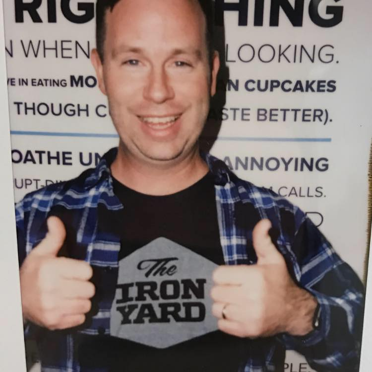

### Learning Experience

I learned _a ton_ this year. Mostly I learned that a band director can pretty much do anything. That "education" role touches so many different skills, what the workplace calls "soft skills" – public speaking to large groups, organization skills, being on time to things, problem-solving, managing personnel, dealing with finances...the list goes on and on. I remain convinced that band directors can do it all!

One day in January I came home from Forney HS to eat lunch, and our Pomeranian Ewok had died that day. He was our "old man", living to be about 15 1/2 years old. Ewok had so much personality, much of it mischievous. This was a sad time for us, but we were glad for all the fun memories with our little friend dating back to the time before Melissa and I were married.

# 2016

### Positive Experience

After working at Call-Em-All only a few months, I mentioned a few times that "I wish there was a React meetup in Dallas." My time in Austin, TX meant I was around many potential nerdy tech meetups every day. I went to a few of them regularly. I always attended Refresh Austin in downtown on the upper floor of a bar. I enjoyed the Sass meetup at Capital Factory, where I first met [Una Kravets](https://twitter.com/una) in person – she became one of my internet heroes! Back to Call-Em-All...the final time I mentioned "React meetup", our VP of Engineering [Hai Nguyen](https://www.linkedin.com/in/hihai/) told me to go get a company credit card and start the meetup.

I did! We started the [ReactJS Dallas meetup](https://www.meetup.com/ReactJSDallas/) in February 2016. The organizers are Hai, [Nitin Shetty](https://www.linkedin.com/in/shettynitin/), and me, with most of the legwork falling to me. I surveyed the Dallas scene for other tech meetups and determined that the 2nd Tuesday of each month was mostly deserted by other groups. We established all our events on that recurring schedule with our 1st event in March 2016. That first event had 20-25 attendees, and we held it at the Call-Em-All offices in Hall Office Park in Frisco, TX. It was International Women's Day, and Morry Kang from TourConnect was our first speaker ever with an "Intro to React" talk. We were nervous but had fun.

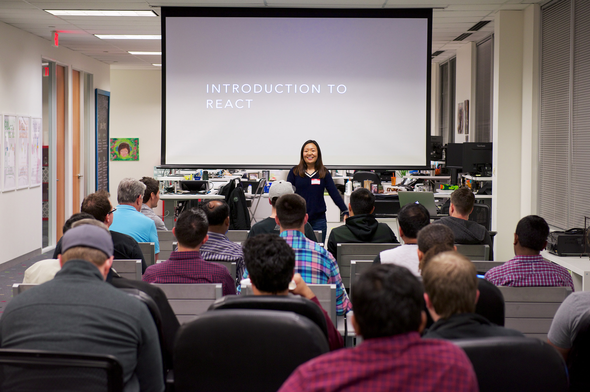

We have never missed a month for 46 straight months. The ReactJS Dallas User Group now has over 2400 members. Our events are big, and people routinely meetup fellow tech enthusiasts. Many get connected to employment opportunities. What a positive experience for all!

Call-Em-All also started a local meeting of Coder Dojo in our office. Our group set a schedule of meeting every other Saturday morning. I volunteered for nearly every event. My background as a teacher could be helpful here, though mostly the students were encouraged to seek out answers on their own. It was a fun time, and my own two older children Isaac and Alexis started to attend as well. Hopefully they learned at least a little coding to help them along the road later on!

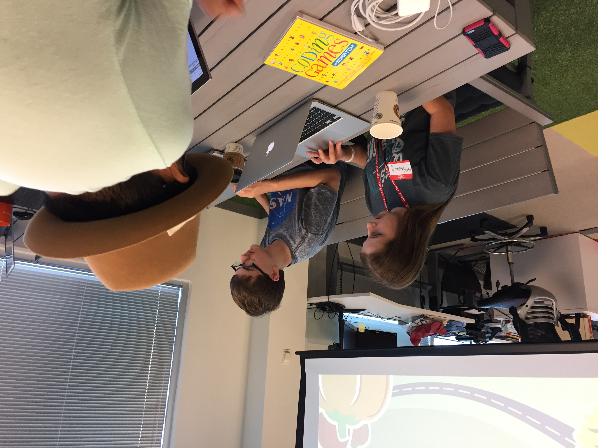

Also of note:
- Alexis finished elementary school in Mesquite as a 5th grade student.
- We sold our house in Forney.
- We rented a house in the area of Garland, TX where the kids could go Berkner High School. **#TeamBerkner**
- Alexis started band playing bassoon...AND entered elementary school again as a 6th grade student in her new district.
- Stephen started his Senior year as a new student in the drum line at Berkner High School.

### Learning Experience

Starting at Call-Em-All was eye-opening. I learned fast that I was great at some things, but had much to learn in other areas. I think that I had a bit of [impostor syndrome](https://en.wikipedia.org/wiki/Impostor_syndrome) during this time. Our engineering team was pretty small still, so all of us sat in on engineering interviews. I saw several people come through, have to deal with whiteboarding problems, get nervous...the usual thing that people in tech have experienced over the years. Thinking back to my own interview with the CEA team, I did no technical portion at all. It was only a culture interview, and a quick offer. I started to wonder if I was on a probationary status. So, being the kind of person I am, I worked a lot harder to get "caught up".

I mentioned all of this later to a co-worker who had helped me learn Redux. He heartily laughed and assured me that the things he was teaching me he had only learned a few days prior, too! Whew! 😅 Turns out that I was doing fine the whole time. It took me a long while to feel that confidence in my bones, though. When I questioned another co-worker about the lack of technical portion in my interview, he assured me that the team felt confident about me because I had _so much_ code out in Github for them to see. That helped put me at ease. I had spent a good while "learning in public", and it paid off!

# 2017

### Positive Experience

My little brother Stephen graduated from Berkner High School. He decided to pursue a degree in Music Education from the University of Texas at Arlington. After we raised him for ten years, we finally watched him cross this portal into the rest of his life!

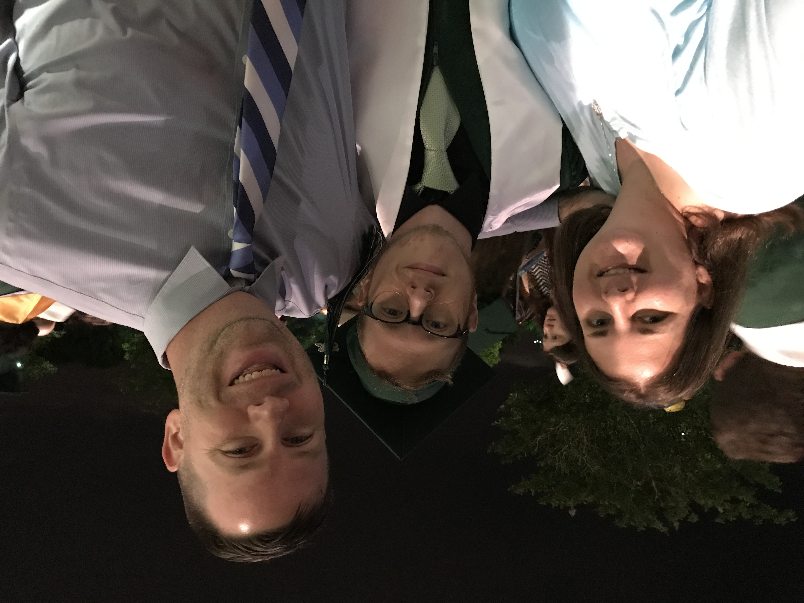

On Easter I visited Arapaho Road Baptist Church to check out the place. I was scheduled to start playing drums there a couple of weeks later. Turns out I have only missed 3-4 Sundays in the intervening two and half years. It's a fun place to attend and play in the worship band!

At the end of the year, I started planning out a [new website](https://www.texasmusicadmin.com/) for the Texas Music Administrators Conference. Once Jeff Turner, Director of Fine Arts in Allen ISD, got involved a few months later, we built a plan to address the needs of the group. This was a fun project, and I still help keep the site tidy for them.

### Learning Experience

Early in the morning of Easter I got word that my father Mark Mathew had passed away in California. I had only been around my dad a couple of times since he and my mom split up around 1980. We got along famously, both having the same oddball wit and sense of humor. Most of our interactions were via Facebook. Melissa and I flew out to California for a memorial service for my dad. I finally met my three half-siblings in Cali. Stephen and Jennifer are the oldest and share a mom. Audri came much later, and she is the fourth daughter from her mom. So, if you count Audri's half-sisters (which we do, _of course_), we met my SEVEN half-siblings and all their families for the first time. It was pretty fun.

As ever, if your parents are still here on earth, then you should make sure to communicate with them often and shower them with love. Both of my parents are gone, so my time with them here is over.

Here's the last message that my father Mark ever sent me on Facebook Messenger. I think that just about sums everything up!

# 2018

### Positive Experience

We bought a new house that fits everyone really well. It's only a few minutes from the apartment where we lived when Isaac was born in 2002. The location means all work and most family are less than 30 minutes away, and we live exactly one mile from my uncle Ricky and aunt Teri.

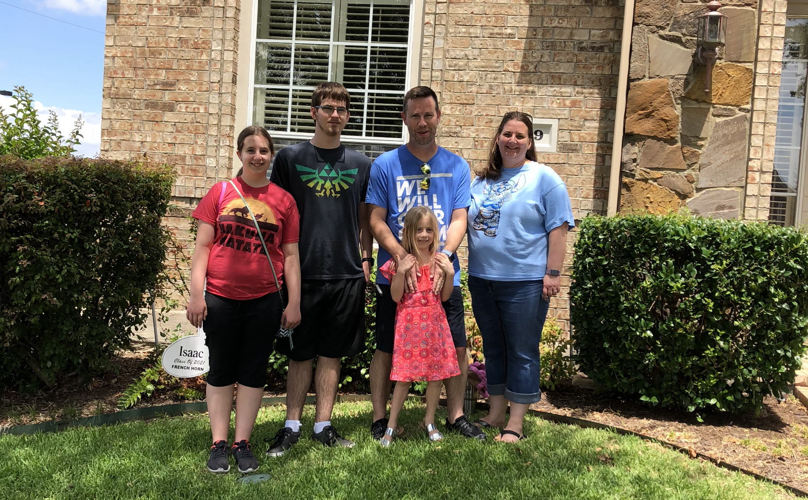

My friend [Austin Chappell](https://www.linkedin.com/in/austin-chappell-2348145a/) and I started planning and building [Presto Assistant](https://www.presto-assistant.com/), an app to help fine arts teachers get and stay organized. Each of us had friends reach out and asked us to build something like Presto that would replace their old and unreliable existing tools. Austin and I had both done a good deal of software work by this point, even some projects for people outside of the companies where we worked. We agreed to get started on a project that would meet the needs of our music education friends.

### Learning Experience

Our family took a vacation to Galveston for several days, our first in several years. It was good to get away and unplug for a while. Melissa and I (and the kiddos) all agreed that we should be getting away more often!

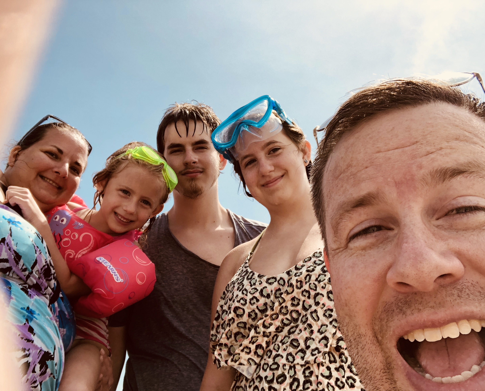

# 2019

### Positive Experience

Presto Assistant proved to be a project that Austin and I both love to work on. But, like any project that pursues excellence, it takes a long time. We made significant progress on all parts of the app, and we divided the labor in a way that made us work faster and smarter. We can see it being our full-time job one day. Presto is going to help a _lot_ of people. Our famous Presto Summits are held most weekends. It's a chance for us to work side-by-side on the project and handle some of the longer-term planning.

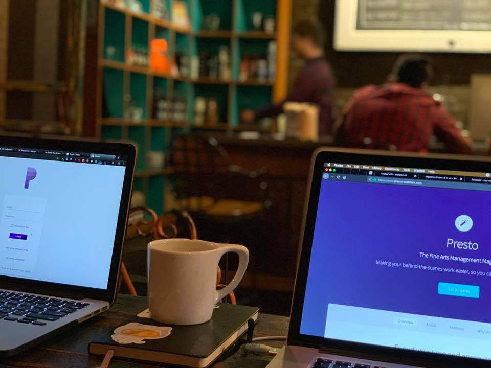

Our two oldest children Isaac and Alexis were in the Berkner Symphonic Band 1, the top performing wind ensemble at the school. In December the Symphonic Band 1 group performed an hour-long concert at the Midwest Band and Orchestra Convention in Chicago. Melissa, Olivia, and I traveled to Chicago to watch their performance. The band was amazing! Also, Chicago is a great city, but December is _very_ cold there!

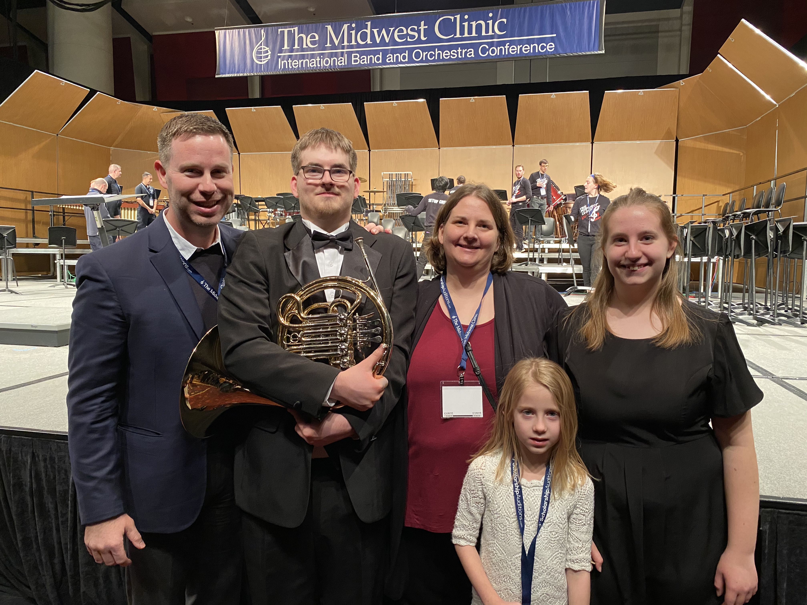

### Learning Experience

In 2019 I began to wonder if a job in a different company would allow me to progress and learn more. I have only worked at one place for my whole tech career so far. I know people with a similar timeline in tech that have switched jobs and moved up to senior engineer level with higher pay. That title that doesn't exist at the company where I work. I start to talk to a few companies and go on some interviews. None of the interviews worked out with an offer for various reasons, but I learned something from each experience. The last interview I experienced would have had an offer, but they wanted me to start ASAP. My current team was already about to lose a full-time engineer, and I was one of two full-time engineers on our new native app project. I didn't want to leave the team in a difficult position by immediately leaving.

I learned that I haven't been practicing algorithms enough. This seems to be the main way people want to discern the engineering prowess of another person. I also learned that I am confident in React – I can talk about and do most anything in React after using it every day for over four years. And, as expected, I am comfortable talking to people in interviews, but I need to be more assertive with regards to my abilities. Oh, I also need to learn a programming language like C# or Java to truly be full-stack. This will allow me freedom to build anything I want, too!

My brief foray into interviewing was healthy for me. I learned more about myself. I also saw patterns that I liked and others I will avoid when hiring people for my own company in the future.

I remain thankful that I have a great job that allows me a tremendous amount of freedom to grow and learn. Also, my Call-Em-All team encourages me to work on Presto. They clearly see how much I am learning from it, which means I bring more knowledge and experience to the Call-Em-All team!

### Wrapping Up

I leave you with this universal truth. I hope that the next decade is full of as many adventures and fantastic memories!

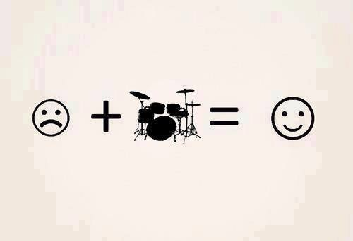
